## DeepDreaming

A PyTorch implementation of the [**DeepDream algorithm**](https://en.wikipedia.org/wiki/DeepDream).

<div style="display: flex; flex-direction: column; align-items: center; margin: 20px 0;">
  <div style="display: flex; flex-direction: row; align-items: center; justify-content: center; width: 100%;">
    
    <div style="display: flex; flex-direction: column; align-items: center; margin: 0 10px;">
      <div style="font-size: 18px; font-weight: bold; margin-bottom: 5px;">Dreaming...</div>
      <div style="font-size: 36px;">🔃</div>
    </div>
    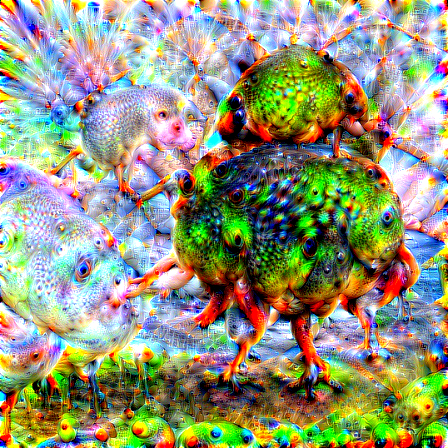
  </div>
</div>

DeepDream is a _fascinating_ computer vision algorithm that creates dreamlike hallucinogenic appearances in images. While there are many great implementations available, I wanted to create something more accessible and user-friendly.

This project offers two key features:
1. A simple web interface built with `Streamlit` where anyone can experiment with DeepDream without writing code
2. A cleaner implementation of layer access in PyTorch using _forward hooks_ rather than hardcoded model redefinition. With this approach you could use **any pretrained model** not only the couple of hardcoded!

<div align="center">
  <a href="https://github.com/Lassa30/deepdreaming/actions/workflows/tests.yml">
    
  </a>
</div>

## Getting Started

There are two ways to experience `DeepDreaming`:
1. Play with the Streamlit demo
2. Dream deeper with Jupyter Notebooks

Each approach has detailed guides below. Remember that DeepDream doesn't have a one-size-fits-all configuration - you'll get the **best results** by experimenting with different settings for each image!

## Web Demo

<div style="display: flex; justify-content: center; margin: 20px 0;">
  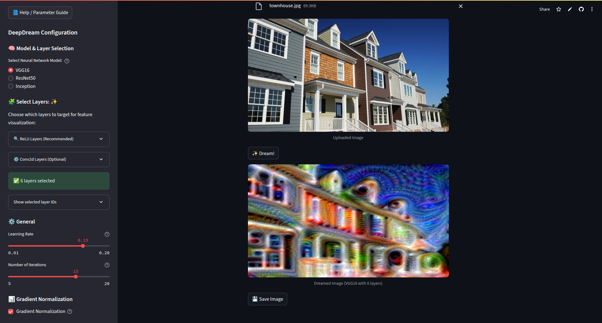
</div>

<div align="center">
  <a href="https://deepdreaming.streamlit.app/">
    
  </a>
</div>

The Streamlit app provides an _intuitive interface_ for experimenting with DeepDream. Simply upload an image, adjust the parameters, and watch the algorithm transform your image into a dream-like visualization.

**Note:** The web demo may run slowly, especially on shared servers. For performance reasons, your input images will be downscaled to:
- `(224, 224)` pixels for VGG and ResNet models
- `(299, 299)` pixels for Inception model

The default settings work well for most images, so you can get started right away. If you're curious about what each parameter does, just click the help button (❔) next to each control for a detailed explanation!

Help page is also present. Click here to gain more intuition about parameters availiable.

<div style="display: flex; justify-content: center; margin: 20px 0;">
  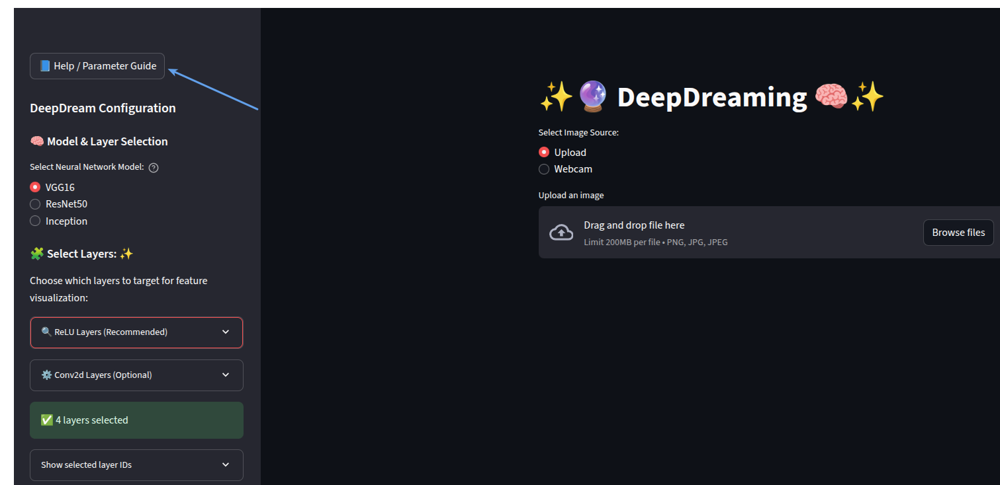
</div>

## Notebooks

### Kaggle Notebooks
<div align="center">
  <p><strong>1. <em>DeepDream Starter</em></strong> - Get started with the basic implementation and concepts!</p>
  <a href="https://www.kaggle.com/code/vladislavlassa/deepdream-starter">
    
  </a>
  <br><br>
  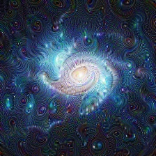
  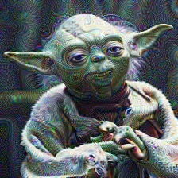
  
  <p><strong>2. <em>DeepDream Tricks</em></strong> - Playing with different settings from gradient smoothing to image pyramid!</p>
  <a href="https://www.kaggle.com/code/vladislavlassa/deepdream-tricks">
    
  </a>
  <br><br>
  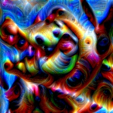
  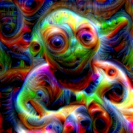
  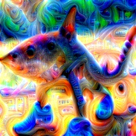
<div align="center">
  <p><strong>3. <em>DeepDream Guided</em></strong> - Discover how we can transfer features from one image to another.</p>
  <a href="https://www.kaggle.com/code/vladislavlassa/deepdream-guided">
    
  </a>
  <br><br>
  <div>
    <p style="font-size: 18px;">🌌 Space ➡️ Yoda 👽</p>
    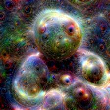
  </div>
  <div>
    <p style="font-size: 18px;">🐊 Crocodilo ➡️ Space 🌌</p>
    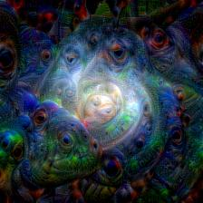
  </div>
  <div>
    <p style="font-size: 18px;">🌳 Tree ➡️ Yoda 👽</p>
    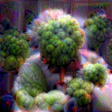
  </div>
  <div>
    <p style="font-size: 18px;">🐊 Crocodilo ➡️ Tree 🌳</p>
    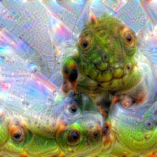
  </div>
</div>
</div>

### GitHub Notebooks

The notebook files in this repository are not pre-executed, as executing them would make the files too large to be displayed properly on GitHub. If you want to see the outputs, please use the Kaggle notebooks linked above or clone the repository and run them locally. Remember that each notebook needs to be configured with paths to input image directories before running.

Source notebooks available in this repository:
- [DeepDream Tricks](deepdream-tricks.ipynb) - Explore various techniques to enhance your DeepDream outputs
- [DeepDream Guided](deepdream-guided.ipynb) - Learn how to transfer features between images

There is one pre-executed notebook available in a separate branch:
- [DeepDream Starter](https://github.com/Lassa30/deepdreaming/blob/basic-deepdream/deepdream-starter.ipynb) - A beginner-friendly introduction to the DeepDream algorithm with outputs visible

## Run Locally

Running the Streamlit app locally is recommended for better performance, especially if you have a GPU. Here's how to get started:

```bash
# 1. Clone the repository
git clone https://github.com/Lassa30/deepdreaming.git
cd deepdreaming

# 2. Create a virtual environment (optional but recommended)
python -m venv venv
source venv/bin/activate  # On Windows: venv\Scripts\activate

# 3. Install the package and dependencies
pip install .            # Install the package in standard mode
# OR for development mode:
pip install -e .         # Install in editable mode for development

# 4. Run the Streamlit app
streamlit run app/main.py
```

This project has been tested with `Python 3.12.3`, but should work with other recent Python versions as well.

## Acknowledgements

- Google initial DeepDream implementation helped me a lot with guided dreaming: [GitHub](https://github.com/google/deepdream/tree/master)
- The AI Epiphany - is my source of inspiration for this project: [YouTube](https://www.youtube.com/@TheAIEpiphany), [GitHub](https://github.com/gordicaleksa/pytorch-deepdream)

## License
<div align="center">
    <a href="https://github.com/Lassa30/deepdreaming/blob/main/LICENSE">
        
    </a>
</div>