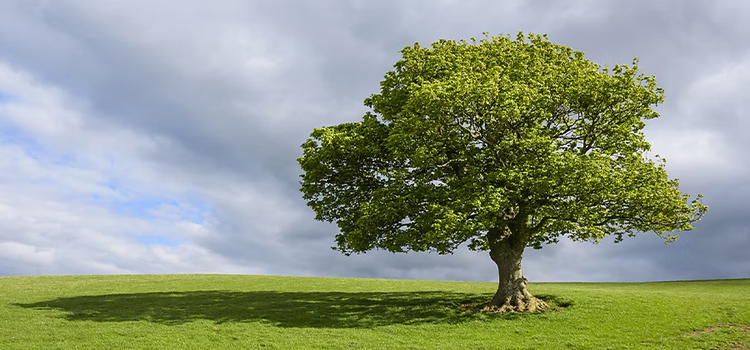

## DeepDreaming

A PyTorch take on the mind-bending, slightly underrated DeepDream algorithm.

Want to see `DeepDreaming` in action? Check out the interactive Kaggle notebooks below and start dreaming with your own images.

## Notebooks
The `DeepDream Starter` version shows how DeepDream could work without implementing any additional tricks like an **image pyramid** or **gradient smoothing:**

  

## Basic DeepDream: just gradient ascend!
This is the classic DeepDream approach: at each step, we simply maximize the activations of chosen layers in the neural network.

 
 

*Parameters:*
- iterations: `30`
- learning rate: `0.05`
- layers: `"layer2[3].relu", "layer3[5].conv1"`

## Basic DeepDream: using reference image
Unlike standard DeepDream (which amplifies existing patterns), this version transplants features from a reference image. For each activation in your image, we:
*  Find the most similar pattern in the reference
*  Adjust the image to enhance this match

### Ferrari + Space

You can see space-like patterns everywhere in the image
### Bombordiro Crocodilo + Tung Tung Tung Tung Sahur

It just became even more crazy

*Parameters:*
- [Check in the notebook](deepdream-starter.ipynb)

## Installation
You don’t have to install anything to try `DeepDreaming` — just open one of the [kaggle notebooks](#notebooks) and start playing.

*Some important notes:*
1. Install the ImageNet classes [here](https://gist.github.com/4e1342c10a71981d0b491e1b8227328b.git)
2. All sample images could be found in [the kaggle dataset](https://www.kaggle.com/datasets/vladislavlassa/deepdream-sample-images)
3. Notebook in GitHub repo is empty to save your disk space - check kaggle version to see the results

## Acknowledgements
- Google initial DeepDream implementation: [GitHub](https://github.com/google/deepdream/tree/master)
- The AI Epiphany: [YouTube](https://www.youtube.com/@TheAIEpiphany), [GitHub](https://github.com/gordicaleksa/pytorch-deepdream)

## Licence

    

